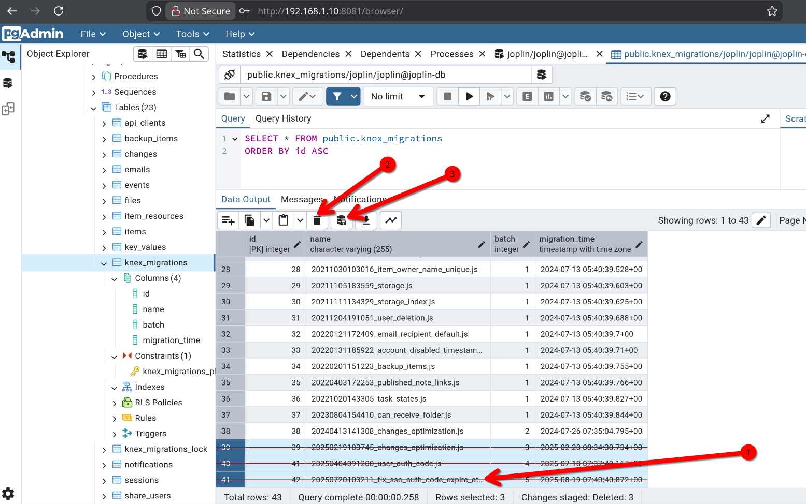

# Upgrading the database in Joplin:

1. Set variable for your data mounts:
	```bash
	JOPLIN_DB_VOLUME=/data/docker/volume/joplin-data
	```
	> **NOTE:** This is fairly generic in that my `/var/lib/postgresql/data` is mounted at `/data/docker/volume/joplin-data`, so set the variable to wherever you keep your data mounted.

2. Create a backup of the database:
	```bash
	docker exec joplin-db /bin/bash -c '/usr/bin/pg_dump -Fc -U joplin joplin' > ${JOPLIN_DB_VOLUME}/backup.dump
	docker kill joplin-db joplin-server
	```

3. At this point, move the mounted directory to some place else. For example:
	```bash
	mv ${JOPLIN_DB_VOLUME} ${JOPLIN_DB_VOLUME}-pg15
	```

4. Update the Postgres version in the docker-compose.yml file. Example:
	```bash
	joplin-db:
	  image: postgres:16
	```
	> **NOTE:** Reference the sample [docker-compose.server.yml](https://github.com/laurent22/joplin/blob/dev/docker-compose.server.yml) file to find the latest supported database version.
	
5. Run the new image and allow the file structure to be created
	```bash
	docker compose up -d --force-recreate joplin-db joplin-server
	```
	
6. Once the database is up and ready to accept connections (you can check this by viewing the logs), go ahead and copy the `backup.dump` file into the new volume mount, and import the database from the backup you created in step 1.
	```bash
	cp ${JOPLIN_DB_VOLUME}-pg15/backup.dump ${JOPLIN_DB_VOLUME}/
	docker exec joplin-db pg_restore --clean -U joplin -d joplin /var/lib/postgresql/data/backup.dump
	```
	
7. You're now running the latest supported version of PostgreSQL with Joplin, and all your notes are intact.

---

# Troubleshooting:

## Database collation version mismatch

If you see the following messages in the database logs:

```txt
database "joplin" has a collation version mismatch

The database was created using collation version 2.36, but the operating system provides version 2.41.

HINT:  Rebuild all objects in this database that use the default collation and run ALTER DATABASE joplin REFRESH COLLATION VERSION, or build PostgreSQL with the right library version.
```


This can be fixed by performing a restore on a clean database.

## Joplin Server will not start due to migration directory corruption

If you see errors like this:

```txt
Error: The migration directory is corrupt, the following files are missing: 20250404091200_user_auth_code.js, 20250720103211_fix_sso_auth_code_expire_at.js
```

1. Connect to the Joplin database with a tool such as PGAdmin (uncomment from `compose.yaml` and deploy/connect in the browser) and manually editting the `knex_migrations` table. Delete the rows specified in the logs.

	**Example:**

	

2. Continue watching the logs. Once the affected rows are removed you should see the server start normally.